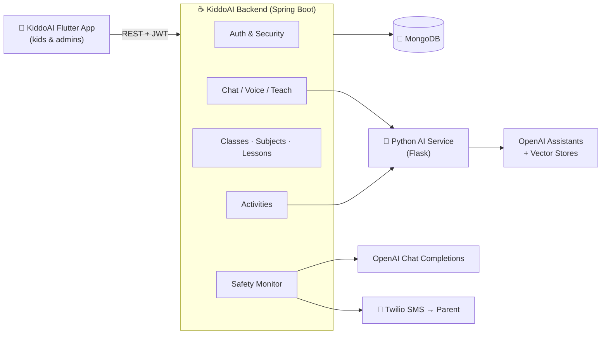

<div align="center">

# 🧸 KiddoAI — Backend

**The Spring Boot API behind KiddoAI, an AI-powered learning companion for primary-school kids.**

AI tutoring · voice chat · adaptive activities · parent safety alerts


</div>

---

## 📖 Table of Contents

- [Overview](#-overview)
- [Features](#-features)
- [Architecture](#-architecture)
- [Tech Stack](#-tech-stack)
- [Project Structure](#-project-structure)
- [Getting Started](#-getting-started)
- [Configuration](#-configuration)
- [API Reference](#-api-reference)
- [Running with Docker](#-running-with-docker)
- [Related Repositories](#-related-repositories)

---

## 🌟 Overview

KiddoAI is a learning platform for children in grades 1 to 6. Kids chat with a friendly AI tutor (by text or voice), follow lessons organized by class and subject, and solve generated exercises whose difficulty follows their level.

This repository is the **REST backend**. It handles authentication, school content (classes → subjects → lessons), activities and scoring, and it coordinates the AI services. It also includes a **child-safety layer**: messages that suggest bullying, danger, or self-harm trigger an SMS alert to the parent.

---

## ✨ Features

| | Feature | Description |
|---|---|---|
| 🔐 | **Secure authentication** | Sign-up and login with JWT access and refresh tokens, plus role-based access (`ADMIN`, `KID`) |
| 🤖 | **AI tutor chat** | Conversation threads per child, backed by an OpenAI Assistant through a Python/Flask AI service |
| 🎙️ | **Voice interaction** | Upload a child's audio; it is transcribed and answered by the tutor |
| 📚 | **Lesson teaching** | The tutor explains a specific lesson, using uploaded lesson PDFs stored in a vector store |
| 🧩 | **Generated activities** | Exercises generated per lesson, subject, and level, with accuracy tracking |
| 🧠 | **Adaptive profile** | Each child has an IQ category, a class, a total score, and a favorite character |
| 🛡️ | **Parent safety alerts** | Messages are screened with an LLM, and flagged issues are sent to the parent by **Twilio SMS** |
| 🏫 | **Admin dashboard API** | Manage classes, subjects, and lessons, upload lesson PDFs, and configure vector stores |
| 📑 | **Swagger UI** | Interactive API docs through springdoc-openapi |

---

## 🏗 Architecture



---

## 🛠 Tech Stack

| Layer | Technology |
|---|---|
| Language | Java 17 |
| Framework | Spring Boot 3.4.2 (Web, WebFlux `WebClient`, Validation) |
| Security | Spring Security + JJWT 0.11.5 |
| Database | MongoDB (Spring Data MongoDB) |
| AI | OpenAI API, external Python/Flask AI service |
| Messaging | Twilio SDK 10 |
| Docs | springdoc-openapi (Swagger UI) |
| Build / Deploy | Maven Wrapper, Docker |
| Utilities | Lombok, java-dotenv, org.json |

---

## 📂 Project Structure

```
src/main/java/com/example/kiddoai
├── Config/          # Security, JWT filter, CORS, MongoDB, app beans
├── Controller/      # REST endpoints (auth, users, chat, lessons, activities, admin)
├── Entities/        # Mongo documents & DTOs (User, Lesson, Subject, Classe, Activity…)
├── Repositories/    # Spring Data Mongo repositories
├── Services/        # Business logic & integrations (AI, OpenAI, Twilio, JWT)
└── KiddoAiApplication.java
src/main/resources
└── application.properties
```

---

## 🚀 Getting Started

### Prerequisites

- **JDK 17+**
- **MongoDB**: a local instance or MongoDB Atlas
- An **OpenAI API key**
- A **Twilio** account, for parent SMS alerts
- The **KiddoAI Python AI service** running and reachable

### 1. Clone

```bash
git clone https://github.com/achreflajmi/KiddoAI-Backend.git
cd KiddoAI-Backend
```

### 2. Configure environment

Create a `.env` file at the project root (it is already git-ignored). See [Configuration](#-configuration).

### 3. Build and run

```bash
# Linux / macOS
./mvnw spring-boot:run

# Windows
mvnw.cmd spring-boot:run
```

The API starts at **`http://localhost:8081/KiddoAI`**.

📑 Swagger UI: **`http://localhost:8081/KiddoAI/swagger-ui/index.html`**

---

## ⚙️ Configuration

### `.env` (project root)

```env
MONGODB_URI=mongodb+srv://<user>:<password>@<cluster>/KiddoAI
OPENAI_API_KEY=sk-...
TWILIO_ACCOUNT_SID=AC...
TWILIO_AUTH_TOKEN=...
```

### `application.properties`

| Property | Default | Description |
|---|---|---|
| `server.port` | `8081` | HTTP port |
| `server.servlet.context-path` | `/KiddoAI` | Base path for all endpoints |
| `security.jwt.secret-key` | `${JWT_SECRET_KEY}` | HMAC secret for signing JWTs, read from the `JWT_SECRET_KEY` environment variable |
| `security.jwt.expiration-time` | `3600000` | Access token lifetime (1 h) |
| `security.jwt.refresh-expiration-time` | `604800000` | Refresh token lifetime (7 days) |

> **JWT secret**
> Set the `JWT_SECRET_KEY` environment variable to a Base64 key of at least 256 bits before starting the app. You can generate one with `openssl rand -base64 32`.

> **Note**
> The Python AI service URL is currently set in `AiService`, `ChatbotService`, and `FlaskAssistantService`. Update it to point to your own AI service (for example, your local Flask server or ngrok tunnel).

---

## 📡 API Reference

All routes are prefixed with **`/KiddoAI`**. 🔒 means a `Authorization: Bearer <token>` header is required.

<details>
<summary><b>🔐 Authentication</b> · <code>/auth</code></summary>

| Method | Endpoint | Description |
|---|---|---|
| `POST` | `/auth/signup` | Register a new user |
| `POST` | `/auth/login` | Log in and receive access and refresh tokens |

</details>

<details>
<summary><b>👤 Users</b> · <code>/users</code> 🔒</summary>

| Method | Endpoint | Description |
|---|---|---|
| `GET` | `/users/me` | Current authenticated user |
| `GET` | `/users/` | List all users |
| `PUT` | `/users/updateIQCategory` | Update a child's IQ category and thread |
| `PUT` | `/users/updateProfile` | Update the profile |
| `GET` | `/users/subjects` | Subjects for the child's class |

</details>

<details>
<summary><b>🤖 Chat & Tutoring</b> · <code>/chat</code> 🔒</summary>

| Method | Endpoint | Description |
|---|---|---|
| `POST` | `/chat/send` | Send a text message to the AI tutor |
| `POST` | `/chat/welcome` | Personalized welcome message |
| `POST` | `/chat/transcribe` | Send an audio file (`audio`, `threadId`) for voice chat |
| `POST` | `/chat/teach_lesson` | Ask the tutor to teach a specific lesson |

</details>

<details>
<summary><b>🧩 Activities</b> · <code>/Activity</code></summary>

| Method | Endpoint | Description |
|---|---|---|
| `GET` | `/Activity/problems/{userId}` | Generated problems for a user |
| `POST` | `/Activity/saveProblem` | Create an activity with generated problems |
| `POST` | `/Activity/updateActivityLesson` | Save the activity accuracy result |
| `POST` | `/Activity/add` | Add an activity |

</details>

<details>
<summary><b>📚 Lessons & Subjects</b> · <code>/Lesson</code>, <code>/Subject</code></summary>

| Method | Endpoint | Description |
|---|---|---|
| `POST` | `/Lesson/add` | Add a lesson |
| `GET` | `/Lesson/bySubject/{subject}` | Lessons of a subject |
| `GET` | `/Subject/all` | All subjects |
| `POST` | `/Subject/classes/{classeName}/subjects` | Add a subject to a class |

</details>

<details>
<summary><b>🏫 Admin Dashboard</b> · <code>/adminDashboard</code> 🔒</summary>

| Method | Endpoint | Description |
|---|---|---|
| `POST` | `/adminDashboard/classes` | Create a class |
| `GET` | `/adminDashboard/classes` | List classes |
| `POST` | `/adminDashboard/classes/{classeName}/subjects` | Add a subject to a class |
| `GET` | `/adminDashboard/classes/{classeName}/subjects` | Subjects of a class |
| `POST` | `/adminDashboard/subjects/{subjectName}/lessons` | Add a lesson to a subject |
| `GET` | `/adminDashboard/subjects/by-name/{subjectName}/lessons` | Lessons of a subject |
| `POST` | `/adminDashboard/uploadLessonPDF` | Upload a lesson PDF to the AI vector store |

</details>

---

## 🐳 Running with Docker

```bash
# 1. Build the jar
./mvnw clean package -DskipTests

# 2. Build the image
docker build -t kiddoai-backend .

# 3. Run (pass your secrets via the .env file)
docker run -p 8081:8081 --env-file .env kiddoai-backend
```

---

## 🔗 Related Repositories

| Repo | Description |
|---|---|
| [KiddoAI-Front](https://github.com/achreflajmi/KiddoAI-Front) | Flutter mobile app for kids and admins |
| **KiddoAI-Backend** | This repository: the Spring Boot REST API |

---

<div align="center">

Made with ❤️ for curious little minds.

</div>
